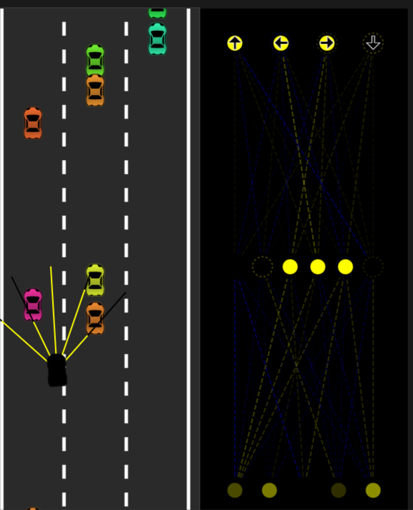

# Self-Driving Car Neural Network Simulation




A JavaScript-based simulation of self-driving cars using neural networks and genetic algorithms.
---
## Features

🚗 **AI Cars**: 100 cars with neural networks learning to drive
🧠 **Neural Network**: 5-input, 6-hidden, 4-output network architecture
📡 **Sensors**: Ray-casting sensors for obstacle detection
🛣️ **Environment**: Multi-lane road with traffic cars
🔄 **Genetic Algorithm**: Evolutionary training with mutation
📊 **Real-time Stats**: Generation, best score, cars alive, time
💾 **Persistence**: Save and load best performing networks

## How It Works

### Neural Network Architecture

- **Inputs**: 5 sensor readings (distance to obstacles)
- **Hidden Layer**: 6 neurons with bias
- **Outputs**: 4 controls (forward, left, right, reverse)

### Training Process

1. 100 cars start with random neural networks
2. Cars navigate through traffic using sensor input
3. Fitness is measured by distance traveled
4. Best performing car's brain is saved
5. New generation created with mutations of the best brain
6. Process repeats for continuous improvement

### Sensors

- 5 ray-casting sensors spread in a fan pattern
- Detect road boundaries and traffic cars
- Provide distance information to neural network

## Controls

- **Start Simulation**: Begin the training process
- **Pause**: Pause the current simulation
- **Reset**: Reset to generation 0 with random networks
- **Save Best**: Save the best performing network to local storage
- **Load Best**: Load previously saved network

## Files Structure

- `index.html` - Main HTML file with UI
- `main.js` - Main simulation logic and genetic algorithm
- `car.js` - Car class with physics and controls
- `road.js` - Road environment and lane management
- `sensor.js` - Ray-casting sensor implementation
- `network.js` - Neural network and training logic
- `utils.js` - Utility functions for math and collision detection

## Running the Simulation

1. Start a local HTTP server in the project directory:

   ```bash
   python3 -m http.server 8000
   ```

2. Open your browser and navigate to:

   ```
   http://localhost:8000
   ```

3. Click "Start Simulation" to begin training

## Tips for Best Results

- Let the simulation run for multiple generations
- Use "Save Best" to preserve good performing networks
- Load saved networks to continue training from a good starting point
- Each generation typically lasts 30 seconds or until all cars crash

## Technical Details

- **Physics**: Realistic car movement with acceleration, friction, and steering
- **Collision Detection**: Polygon-based collision system
- **Mutation Rate**: 10% mutation rate for genetic diversity
- **Population Size**: 100 cars per generation
- **Sensor Range**: 150 pixel detection range
- **Sensor Count**: 5 rays for environmental awareness

The simulation demonstrates how neural networks can learn complex behaviors through evolutionary algorithms, showing emergent driving behaviors as the AI learns to navigate traffic.
